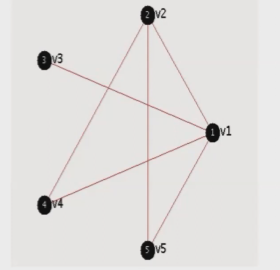
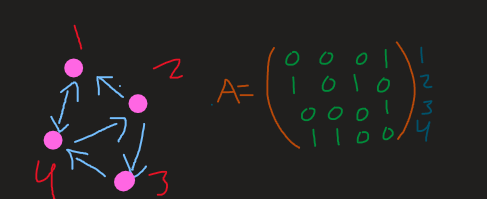

<p>
  
</p>


# Teoría de Ciencia de Redes.
## ¿Qué es la ciencia de redes? 📖🔎
Las Ciencias de redes se han ido contruyendo a lo largo del tiempo ya que se ha conformado desde diferentes ramas. Estos parten de *sistemas complejos no lineales*. El requerimiento para estudiar la ciencia de redes son:
1. Teoría de gráficas.
2. Las bases de datos y la programación.
3. La física estadística.

## Definición.

* Un conjunto de vértices (o nodos) y,
* Un conjunto de parejas ordenadas, llamadas **aristas** entre dos nodos. 
<p>
  
</p>

\begin{equation}
    G=(V,E)
\end{equation}
Donde;
\begin{equation}
    V=\left\{v_{1},v_{2},\dots,v_{n}\right\} \ E\subseteq V\times V
\end{equation}
y 
\begin{equation}
    E=\left\{e_{1},e_{2},\dots,e_{m}|e_{i}=(v_{i},v_{j})\right\} \ v_{i}, v_{j}\in V
\end{equation}


### Matriz de Adyacencia. 
Es la representación del grafo como una matriz. 
<p>
  
</p>

\begin{equation}
    a_{ij} = 1 \ si \ (v_{i},v_{j})\in E
\end{equation}
\begin{equation}
    a_{ij} = 0 \ si \ (v_{i},v_{j})\not\in E
\end{equation}
\begin{equation}
A = 
\begin{pmatrix}
    0&1&1&1&1\\
    1&0&0&1&1\\
    1&0&0&0&0\\
    1&1&0&0&0\\
    1&1&0&0&0
\end{pmatrix}
\end{equation}

La matriz anterior es una matriz simétrica. Y a continuación sería
los *grafos dirigidos y no dirigidos*.
<p>
  
</p>

## Grafos sin auto-conexión, sin dirección, sin pesos. 🎈
Para obtener las aristas de $n$ nodos es la manera de contar parejas.
\begin{equation}
    \sum_{i}^{n} i =\left(n\atop2\right) = \frac{n!}{2!(n-2)!} = \frac{n(n-1)}{2}
\end{equation}

**Definición:** Si $N$ es el número de nodos, el número de aristas son:
\begin{equation}
    |E|_{maxima} = \frac{N(N-1)}{2}
\end{equation}

Si la red es **no dirigida** entonces $A$ es **simétrica**. Las **aristas** en este caso serán ahora llamadas pesos. Este grafo **no dirigido** es **sin dirección** $e_{i,j} = a_{i,j}$, la conexión $i,j$ ahora se vuelve pesada $w_{i,j}=a_{i,j}$.

**NOTACIÓN:** Si uno se fija en las conexiones que salen de los nodos quedaría la matriz $A$ que se mostrará en un momento. Pero si ahora se cuenta las conexiones que **entran** entonces la matriz cambia y es la transpuesta. 

<p>
  
</p>
<p>
  
</p>
**Definición.** La *red* de un grafo. Sea $G$ un grafo, $V$ los nodos y $E$ las aristas. La mejor forma de analizar este tipo de redes es mejor usar *la matriz de adyacencia* ya que se utiliza la definición de conjunto de parejas se pierde información que sirve para analizar una red. Entoces el grado o la conectividad e una red se define así:

\begin{equation}
\begin{pmatrix}
    0&1&1&1&1\\
    1&0&0&1&1\\
    1&0&0&0&0\\
    1&1&0&0&0\\
    1&1&0&0&0
\end{pmatrix}
\end{equation}
\begin{equation}
    k = \frac{1}{N}\sum_{i}k_{i}
\end{equation}

**Definición.** *Densidad de red*. Cuando una red no tiene suficientes elementos o está "llenita" en su matriz de adyacencia se le dice que es una red *sparce*.
\begin{equation}
    \delta = \frac{|E|}{|E|_{maxima}} = \frac{L}{L_{maxima}}
\end{equation}
Para $N$ nodos;
\begin{equation}
    L = |E|_{maxima} = \frac{N(N-1)}{2}
\end{equation}
\begin{equation}
    \delta = \frac{2|E|}{N(N-1)}
\end{equation}

Para una red *dirigida*.
\begin{equation}
    \delta = \frac{|E|}{N(N-1)}
\end{equation}

Entonces el **grado promedio de una red** se definiría así;
1. *Una red sin dirección*.
\begin{equation}
    \langle k\rangle = \frac{2|E|}{N}; \ |E| = \sum_{i,j=1}^{N} A_{i,j} = \frac{1}{2}\sum_{i}^{N}k_{i}
\end{equation}

2. Dirigida.

\begin{equation}
    \langle k\rangle = \frac{|E|}{N}; |E| = \sum_{i}^{N}k_{i}
\end{equation}
3. Pesada **sin dirección**.
\begin{equation}
    \langle k \rangle = \frac{2|E|}{N}; |E| = 2\sum_{i}^{N}k_{i}
\end{equation}

# Árboles y caminos en redes.
## ¿Qué es un camino?
Es el conjunto vértices y aristas. Es una subgráfica.

**Promedio de los caminos mínimos entre dos nodos**;
\begin{equation}
    \bar{l} = \frac{1}{N(N-1)}\sum_{i\not=j} d(v_{i},v_{j})
\end{equation}
El efcto de **mundo pequeño**..

\begin{equation}
    \bar{l}\approx\log(N)
\end{equation}

**Definición.** Un camino o *path* es una sub-red $p\subset G(V,E)$ de una red $G$, tal que $P = \left\{v_{p}\subset Vm E_{p}\subset E\right\}$, con $V_{p}=\left\{1,\dots,l\right\}$ y $E_{p}$ el cconjunto ordenado de aristas tal que $E_{p} = \left\{(1,2),\dots,(l-1,l)\right\}$, donde 1 es el nodo inicla del *path* y para cada arista en $E_{p}$ el punto final de cada arista, es el nodo inicial de la siguiente, de tal manera $l$ es el nodo final de $P$, y $l=|E_{p}|$ es la longitud del camino.

**Definición.** Ciclo. Es cuando un camino donde un nodo inicial y final es el mismo.

**Definición.** Árbol. Es dónde no tiene un camino cerrado o que no tiene ciclos. Finalmente la distancia de los caminos más cortos es lo que representa la ecuación de arriba.

# Documentación de NetworkX 🌐


```python
#Impresión de una página web
from IPython.display import IFrame
netX = IFrame(src="https://networkx.org/",width=900, height=400)
display(netX)
```


<iframe
    width="900"
    height="400"
    src="https://networkx.org/"
    frameborder="0"
    allowfullscreen

></iframe>


# Instalación de NetworkX

**Si estas usando una libreta de [Jupyter](https://jupyter.org/) el comando es el siguiente** ```!pip3 install networkx```.
**Si estas instalando por consola el comando es casi análogo** ```pip3 install networkx```


```python
#Importamos el módulo
import networkx as nx

#Crear una gráfica usando el método nx.Graph()

gf = nx.Graph()

#Agregar nodos es con el método .add_node() 
for i in range(7):#Queremos agregar 7 nodos 
    gf.add_node('N{}'.format(i+1))

#Impresión de los 7 nodos usando el método .nodes
print(gf.nodes)
#Como podemos ver nos imprime una lista.
"""
Agregando aristas. Para agregar aristas tenemos de dos formas:
1. Arista por arista.
2. Dar un conjunto de lista de tuplas con las parejas de nodos que queremos
que se una arista.
"""
#Usando 1. Se usa el método .add_edge()
gf.add_edge('N1','N7')
gf.add_edge('N2','N3')

#Usando 2. .add_edge_from([()])
gf.add_edges_from([('N4','N6'),('N5','N1')])

#Si queremos ver el grafo sería con el método nx.draw()

nx.draw(gf)
```

    ['N1', 'N2', 'N3', 'N4', 'N5', 'N6', 'N7']
    


    

    


### Modificando el grafo. 🖍️
Si queremos modificar el grafo poniendo el nombre de los nodos sería ``` nx.draw(graph,with_labels =True)```.

En cambio si queremos modificar el color de los nodos sería ```nx.draw(graph,with_labels = True, node_color = '')```

Si se quiere modificar el tamaño de los nodos ```nx.draw(graph,with_labels = True, node_color = '', node_size = n )``` donde $n$ es el tamaño.

Si se quiere modificar el color de las etiquetas sería ```nx.draw(graph,with_labels = True, node_color = '',node_size = n, font_color='')```


```python
nx.draw(gf,with_labels = True, node_color = 'red', node_size = 500, font_color = 'white')
```


    

    


```python
#Ver cuantos números de aristas hay usamos el método .number_of_edges()
print("Los números de aristas de la gráfica gf son: ",gf.number_of_edges())
#Ver cuantos nodos tenemos usamos el método .number_of_modes()
print("Los números de nodos de la gráfica gf son: ",gf.number_of_nodes())
#Si queremos qué nodos están conectados .neighbors(node) pero es un objeto interable
#por lo que podemos usar un for.
print("El número de nodos conectada con el N1 son: ")
for i in gf.neighbors('N1'):print(i)
print()
#Si tenemos dudas de un método de NetworkX puede usar nx.draw? o help(nx.draw)
help(nx.draw)
```

    Los números de aristas de la gráfica gf son:  4
    Los números de nodos de la gráfica gf son:  7
    El número de nodos conectada con el N1 son: 
    N7
    N5
    
    Help on function draw in module networkx.drawing.nx_pylab:
    
    draw(G, pos=None, ax=None, **kwds)
        Draw the graph G with Matplotlib.
        
        Draw the graph as a simple representation with no node
        labels or edge labels and using the full Matplotlib figure area
        and no axis labels by default.  See draw_networkx() for more
        full-featured drawing that allows title, axis labels etc.
        
        Parameters
        ----------
        G : graph
            A networkx graph
        
        pos : dictionary, optional
            A dictionary with nodes as keys and positions as values.
            If not specified a spring layout positioning will be computed.
            See :py:mod:`networkx.drawing.layout` for functions that
            compute node positions.
        
        ax : Matplotlib Axes object, optional
            Draw the graph in specified Matplotlib axes.
        
        kwds : optional keywords
            See networkx.draw_networkx() for a description of optional keywords.
        
        Examples
        --------
        >>> G = nx.dodecahedral_graph()
        >>> nx.draw(G)
        >>> nx.draw(G, pos=nx.spring_layout(G))  # use spring layout
        
        See Also
        --------
        draw_networkx
        draw_networkx_nodes
        draw_networkx_edges
        draw_networkx_labels
        draw_networkx_edge_labels
        
        Notes
        -----
        This function has the same name as pylab.draw and pyplot.draw
        so beware when using `from networkx import *`
        
        since you might overwrite the pylab.draw function.
        
        With pyplot use
        
        >>> import matplotlib.pyplot as plt
        >>> G = nx.dodecahedral_graph()
        >>> nx.draw(G)  # networkx draw()
        >>> plt.draw()  # pyplot draw()
        
        Also see the NetworkX drawing examples at
        https://networkx.org/documentation/latest/auto_examples/index.html
    
    


```python
# Para verificar si el nodo existe usamos el método .has_node(node) regresa un booleano 
print("Existe el nodo 1? ",gf.has_node('N1'))
#Para verificar si hay conexión u arista entre los nodos usamos le método .has_edge(node_1,node_2)
print("Hay una arista entre el nodo 1 y 7? ",gf.has_edge('N1','N7'))
```

    Existe el nodo 1?  True
    Hay una arista entre el nodo 1 y 7?  True
    

## Ejemplo complementario.🖊️


```python
#Generamos el grafo 1
G= nx.Graph()
#Generamos el grafo 2
G_2 = nx.Graph()
#Agregamos los nodos
nodos = list(range(10))
nodos_2 = list(range(10,100))
G.add_nodes_from(nodos)
G_2.add_nodes_from(nodos_2)
#Imprimimos los nodos agregados
print(G.nodes())
print()
print(G_2.nodes())
print()

#Agregamos aristas.
G.add_edges_from([(3,7),(0,1),(2,8),(9,3),(2,3)])
#Imprimos las aristas.
G.edges()
```

    [0, 1, 2, 3, 4, 5, 6, 7, 8, 9]
    
    [10, 11, 12, 13, 14, 15, 16, 17, 18, 19, 20, 21, 22, 23, 24, 25, 26, 27, 28, 29, 30, 31, 32, 33, 34, 35, 36, 37, 38, 39, 40, 41, 42, 43, 44, 45, 46, 47, 48, 49, 50, 51, 52, 53, 54, 55, 56, 57, 58, 59, 60, 61, 62, 63, 64, 65, 66, 67, 68, 69, 70, 71, 72, 73, 74, 75, 76, 77, 78, 79, 80, 81, 82, 83, 84, 85, 86, 87, 88, 89, 90, 91, 92, 93, 94, 95, 96, 97, 98, 99]
    
    


    EdgeView([(0, 1), (2, 8), (2, 3), (3, 7), (3, 9)])


```python
#Impresión del grafo que se generó G
nx.draw(G,with_labels = True, node_color = 'pink', node_size = 400, font_color = 'blue')
```


    

    


```python
#Notemos que en nuestro grafo hay conexiones y algunas no.
#Entonces para ver si hay conexiones existe el método para ello nx.is_connected(grafo)
print("Esta conectada la red? ",nx.is_connected(G))
print()
#Para ver si hay caminos en la red se usa el siguiente método .has_path(graph,node_1,node_2)
print("Hay camino entre el nodo 6 y 4? ",nx.has_path(G,6,4))
print()
#Si queremos ver el número de los componentes usamos el método .number_of_edges(graph)
print("El numero de componentes en la red son: ",nx.number_of_edges(G))
print()
#Si queremos saber cuantos están conectados solamente es .number_connected_components(graph)
print("Los componentes conetados en G son: ", list(nx.connected_components(G)))
print()
#Empleando la teoría, podemos ver que sí hay un árbol ya que sería un subgrafo de G.
#Para ver si G es un árbol.
print("Es G un árbol?",nx.is_tree(G))
```

    Esta conectada la red?  False
    
    Hay camino entre el nodo 6 y 4?  False
    
    El numero de componentes en la red son:  5
    
    Los componentes conetados en G son:  [{0, 1}, {2, 3, 7, 8, 9}, {4}, {5}, {6}]
    
    Es G un árbol? False
    

### De grafo a subgrafo


```python
#Para crear un subgrafo es con el método nx.subgraph(main_graph,list_of_components_of_graph)
#En este caso vimos que hay un árbol en G que sería  del 2-9
arbol = list(nx.connected_components(G))#Se extrajo la lista de diccionarios.
sub_G = nx.subgraph(G,list(arbol[1]))#Se casteo el segundo elemento de diccionario a lista

#Preguntemos si ahora sí es un árbol el subgrafo

print("Es un árbol el subgrafo de G?",nx.is_tree(sub_G))
#Ahora si queremos convertir toda la gráfica en subgrafos sería la implementación asi
Sub_graph_G=[nx.subgraph(G,list(c)) for c in nx.connected_components(G)]#Es una lista comprimida
print()
#Los subgrafos de G para poder trabajar más cómodo.
for k in range(0,len(Sub_graph_G)):print(Sub_graph_G[k])
print()
#Ahora para ver si son árboles podemos implementar el mismo ciclo
for k in range(0,len(Sub_graph_G)):print("Es un arbol el {}? {}".format(Sub_graph_G[k].nodes(),nx.is_tree(Sub_graph_G[k])))
print()
#Si queremos ver los caminos podemos usar el método que se había dicho anteriormente
print("Hay un camino entre el nodo 7 y 8? ",nx.has_path(Sub_graph_G[1],7,8))
```

    Es un árbol el subgrafo de G? True
    
    Graph with 2 nodes and 1 edges
    Graph with 5 nodes and 4 edges
    Graph with 1 nodes and 0 edges
    Graph with 1 nodes and 0 edges
    Graph with 1 nodes and 0 edges
    
    Es un arbol el [0, 1]? True
    Es un arbol el [2, 3, 7, 8, 9]? True
    Es un arbol el [4]? True
    Es un arbol el [5]? True
    Es un arbol el [6]? True
    
    Hay un camino entre el nodo 7 y 8?  True
    

## Ejemplo con el segundo grafo.🖊️📒


```python
#Como nuentro grafo 2 sería con más conexiones 
#Creamos conexiones aleatorias. Para ello usamos el modulo Random

import random
conexiones = list()
for i in range(0,len(nodos_2)):
    j = random.randint(0,90)
    r = random.randint(0,90)
    conexiones.append((j,r))
#Agregamos las aristas
G_2.add_edges_from(conexiones)
#Imprimimos las aristas
print(G_2.edges)

```

    [(10, 70), (10, 80), (10, 47), (10, 16), (10, 9), (11, 52), (11, 25), (12, 37), (14, 74), (14, 76), (14, 37), (16, 72), (16, 57), (17, 89), (17, 58), (18, 8), (19, 25), (19, 5), (20, 53), (20, 38), (20, 33), (21, 63), (22, 27), (25, 34), (25, 30), (25, 2), (26, 87), (26, 76), (26, 89), (27, 6), (29, 88), (30, 44), (30, 90), (31, 86), (31, 54), (31, 31), (32, 66), (33, 5), (34, 38), (35, 88), (35, 45), (36, 47), (37, 90), (37, 5), (37, 47), (38, 2), (38, 79), (40, 3), (41, 86), (42, 83), (42, 72), (42, 57), (43, 84), (43, 74), (43, 79), (44, 85), (44, 57), (45, 62), (45, 67), (47, 66), (48, 87), (48, 5), (49, 66), (49, 70), (50, 58), (50, 53), (50, 78), (51, 6), (52, 55), (52, 87), (55, 84), (55, 81), (57, 59), (59, 6), (63, 74), (63, 3), (63, 85), (64, 1), (65, 1), (65, 72), (65, 71), (66, 72), (68, 87), (70, 78), (72, 9), (72, 76), (80, 85), (81, 83), (84, 89)]
    


```python
#Impresión del grafo que se generó G_2
nx.draw(G_2, node_color = 'magenta',edge_color='blue', node_size = 100)
```


    

    


```python
#Notemos que en nuestro grafo hay conexiones y algunas no.
#Entonces veremos si hay conexiones.
print("Esta conectada la red? ",nx.is_connected(G_2))
print()
#Veremos si hay caminos en la red 
print("Hay camino entre el nodo 6 y 1? ",nx.has_path(G_2,6,1))
print()
#Veremos el número de los componentes 
print("El numero de componentes en la red son: ",nx.number_of_edges(G_2))
print()
#Veremos cuantos están conectados solamente
print("Los componentes conetados en G_2 son: ", list(nx.connected_components(G_2)))
print()
#Veremos sí hay un árbol ya que sería un subgrafo de G_2.
#Para ver si G_2 es un árbol.
print("Es G_2 un árbol?",nx.is_tree(G_2))
```

    Esta conectada la red?  False
    
    Hay camino entre el nodo 6 y 1?  True
    
    El numero de componentes en la red son:  89
    
    Los componentes conetados en G_2 son:  [{1, 2, 3, 5, 6, 9, 10, 11, 12, 14, 16, 17, 19, 20, 21, 22, 25, 26, 27, 30, 32, 33, 34, 36, 37, 38, 40, 42, 43, 44, 47, 48, 49, 50, 51, 52, 53, 55, 57, 58, 59, 63, 64, 65, 66, 68, 70, 71, 72, 74, 76, 78, 79, 80, 81, 83, 84, 85, 87, 89, 90}, {13}, {15}, {8, 18}, {23}, {24}, {28}, {67, 35, 45, 88, 29, 62}, {86, 41, 54, 31}, {39}, {46}, {56}, {60}, {61}, {69}, {73}, {75}, {77}, {82}, {91}, {92}, {93}, {94}, {95}, {96}, {97}, {98}, {99}]
    
    Es G_2 un árbol? False
    

### De grafo a subgrafo más grande.


```python
#Generación de un arboles con numeros aleatorios.
arbol_2 = list(nx.connected_components(G_2))#Se extrajo la lista de diccionarios.
sub_G_2 = nx.subgraph(G_2,list(arbol_2[1]))#Se casteo el segundo elemento de diccionario a lista

#Preguntemos si ahora sí es un árbol el subgrafo

print("Es un árbol el subgrafo de G_2?",nx.is_tree(sub_G_2))
#Ahora si queremos convertir toda la gráfica en subgrafos sería la implementación asi
Sub_graph_G_2=[nx.subgraph(G_2,list(c)) for c in nx.connected_components(G_2)]#Es una lista comprimida
print()
#Los subgrafos de G para poder trabajar más cómodo.
for k in range(0,len(Sub_graph_G_2)):print(Sub_graph_G_2[k])
print()
#Ahora para ver si son árboles podemos implementar el mismo ciclo
for k in range(0,len(Sub_graph_G_2)):print("Es un arbol el {}? {}".format(Sub_graph_G_2[k].nodes(),nx.is_tree(Sub_graph_G_2[k])))
print()
```

    Es un árbol el subgrafo de G_2? True
    
    Graph with 61 nodes and 79 edges
    Graph with 1 nodes and 0 edges
    Graph with 1 nodes and 0 edges
    Graph with 2 nodes and 1 edges
    Graph with 1 nodes and 0 edges
    Graph with 1 nodes and 0 edges
    Graph with 1 nodes and 0 edges
    Graph with 6 nodes and 5 edges
    Graph with 4 nodes and 4 edges
    Graph with 1 nodes and 0 edges
    Graph with 1 nodes and 0 edges
    Graph with 1 nodes and 0 edges
    Graph with 1 nodes and 0 edges
    Graph with 1 nodes and 0 edges
    Graph with 1 nodes and 0 edges
    Graph with 1 nodes and 0 edges
    Graph with 1 nodes and 0 edges
    Graph with 1 nodes and 0 edges
    Graph with 1 nodes and 0 edges
    Graph with 1 nodes and 0 edges
    Graph with 1 nodes and 0 edges
    Graph with 1 nodes and 0 edges
    Graph with 1 nodes and 0 edges
    Graph with 1 nodes and 0 edges
    Graph with 1 nodes and 0 edges
    Graph with 1 nodes and 0 edges
    Graph with 1 nodes and 0 edges
    Graph with 1 nodes and 0 edges
    
    Es un arbol el [10, 11, 12, 14, 16, 17, 19, 20, 21, 22, 25, 26, 27, 30, 32, 33, 34, 36, 37, 38, 40, 42, 43, 44, 47, 48, 49, 50, 51, 52, 53, 55, 57, 58, 59, 63, 64, 65, 66, 68, 70, 71, 72, 74, 76, 78, 79, 80, 81, 83, 84, 85, 87, 89, 90, 6, 3, 9, 2, 1, 5]? False
    Es un arbol el [13]? True
    Es un arbol el [15]? True
    Es un arbol el [8, 18]? True
    Es un arbol el [23]? True
    Es un arbol el [24]? True
    Es un arbol el [28]? True
    Es un arbol el [35, 67, 45, 88, 29, 62]? True
    Es un arbol el [54, 41, 86, 31]? False
    Es un arbol el [39]? True
    Es un arbol el [46]? True
    Es un arbol el [56]? True
    Es un arbol el [60]? True
    Es un arbol el [61]? True
    Es un arbol el [69]? True
    Es un arbol el [73]? True
    Es un arbol el [75]? True
    Es un arbol el [77]? True
    Es un arbol el [82]? True
    Es un arbol el [91]? True
    Es un arbol el [92]? True
    Es un arbol el [93]? True
    Es un arbol el [94]? True
    Es un arbol el [95]? True
    Es un arbol el [96]? True
    Es un arbol el [97]? True
    Es un arbol el [98]? True
    Es un arbol el [99]? True
    
    
