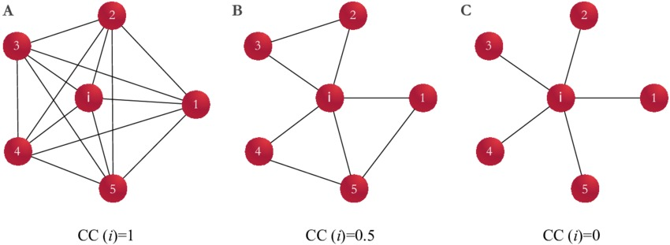
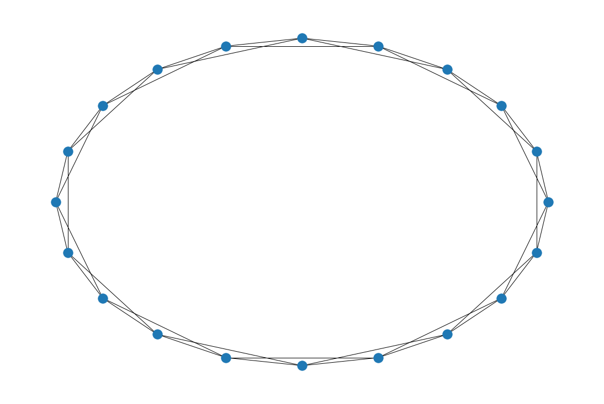
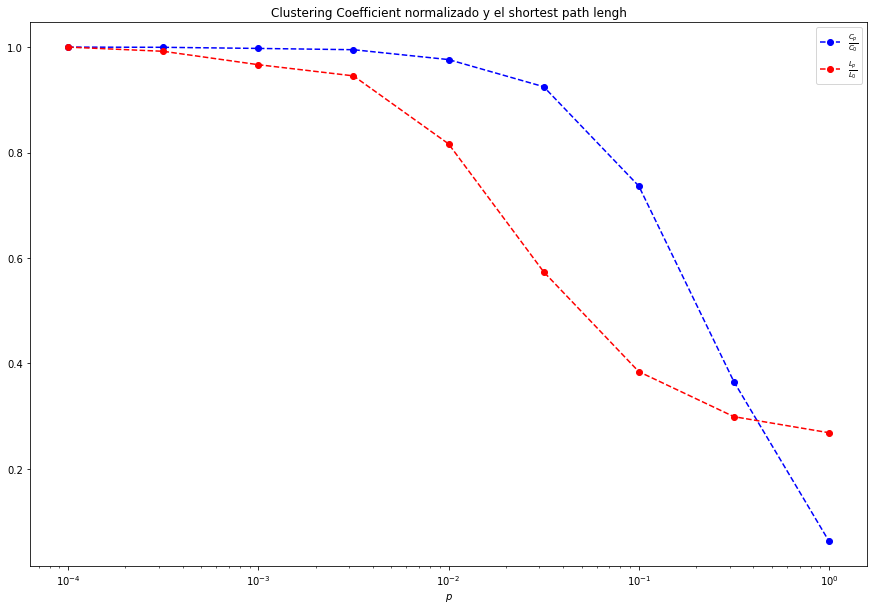
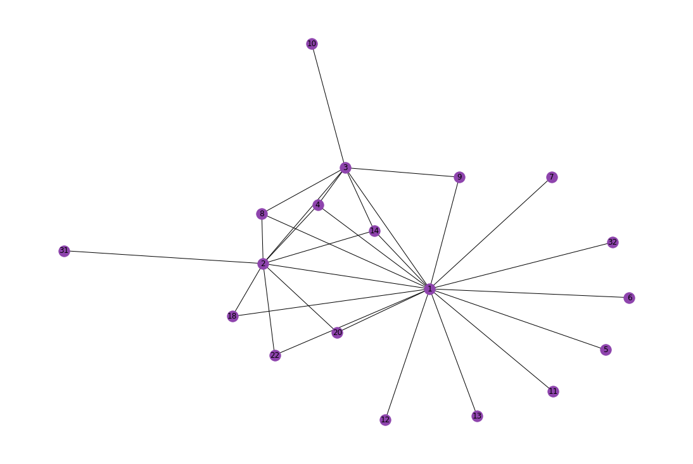

# Caminos en redes.
Considere esta mátriz de Adyacencia.


$$ A =
\begin{pmatrix}
0&1&0&0&1\\
1&0&0&1&1\\
0&0&0&1&1\\
0&1&1&0&0\\
1&1&1&0&0
\end{pmatrix}
$$

¿Qué pasaría si $\displaystyle A^{2}$?


$$ A^{2} =
\begin{pmatrix}
2&1&1&1&1\\
1&3&2&0&1\\
1&2&2&0&0\\
1&0&0&2&2\\
1&1&0&2&3
\end{pmatrix}
$$


¿Y con $\displaystyle A^{3}$?

$$ A^{3} =
\begin{pmatrix}
2&4&2&2&4\\
4&2&1&5&6\\
2&1&0&4&5\\
2&5&4&0&1\\
4&6&5&1&2
\end{pmatrix}
$$

¿Qué significa? 

Simplemente se dará está definición:

$$ A^{n} = |P_{i,j}| = N$$

Donde $n$ es la potencia y $|P_{i,j}|$ significa que es la longitud de los caminos $m$. Esto quiere decir, que por ejemplo en $A^{2}_{1,2}$ hay un camino de longitud 2 en ese nodo. Sin embargo, en $A^{3}_{1,2}$ hay 4 caminos posibles con longitud 3.  

De aquí podemos partir de un concepto que con anterioridad se vio que era el $k$ el número de conexiones.


1. Para redes *no dirigidas*. El número de conexiones del nodo $i$, grado $i$.

    $$k_{i} = g(i)  = \sum_{j=1}^{n}a_{ij}$$ 

    En donde se van sumando las filas de la matriz de adjyacencia pero también pueden ser las columnas.

2. Para redes *dirigidas*, si se tomaron las conexiones que salian sería $k^{out}$ si fue al contrario, entonces sería $k^{in}$ donde son los grados que entran y salen, en donde se suman las columnas.

    $$k^{in}_{i} = \sum_{i=1}^{n}a_{ij}$$
    
    $$k^{out}_{j} = \sum_{j=1}^{n}a_{ij}$$
    
3. Para *redes pesadas y no dirigidas*. Sería la suma de sus pesos, que también se lo conoce como *fuerza* de $i$ de nodos dirigidos.

    $$S_{i} = \sum_{i=1}^{n}w_{ij}$$
    
4. Finalmente, para *redes pesadas y dirigidas*. Aplicaría el mismo concepto para las redes dirigidas.

    $$S_{i}^{in} = \sum_{i=1}^{n}w_{ij}$$
    
    $$S_{j}^{out} = \sum_{j=1}^{n}w_{ij}$$
    
Recordando un poco del grado promedio $\langle k \rangle$.

1. Para redes *no dirigidas*.
    
    $$\langle k\rangle = \frac{1}{n}\sum_{i=1}^{n}\sum_{j=1}^{n}a_{ij}$$
    
    Donde $\displaystyle\sum_{j=1}^{n}a_{ij}$ es $k_{i}$

2. Para redes *dirigidas*.

    $$\langle k^{in}\rangle = \frac{1}{n}\sum_{i=1}^{n}a_{ij}$$
    
    $$\langle k^{out}\rangle= \frac{1}{n}\sum_{j=1}^{n}a_{ij}$$
    
## Longitud promedio y diametro.
El promedio de la longitud de las distancias más cortas.


$$\langle l\rangle  =\displaystyle \frac{\sum_{i=1}l_{ij}} {\binom{n}{2}}=\frac{2\sum_{i}\sum_{j}l_{ij}}{n(n-1)}$$


El *diametro de la red* es la distancia más grande que hay en la red y se define como *el máximo de las distancias más cortas*.

$$D = l_{max} = max(l_{ij})$$

## Clustering Coefficient 🚛🚶🏻
Considere este grafo de [ResearchGate](https://www.researchgate.net/profile/Guilherme-Ferraz-De-Arruda/publication/324745118/figure/fig2/AS:619148942012418@1524628019444/An-example-of-clustering-coefficient-Three-network-configurations-that-result-in.png)


<p align = "center">
    
</p>

Notemos que en la figura C es una red de estrella entonces $C_{i} = 0$ donde llamaremos a $C_{i}$ como *Clustering Coefficient de nodo* $i$.
Pero si nos fijamos en la figura B veamos que $C_{i} = 0.5$ pero el nodo $i$ tiene apenas 5 conexiones y también forma como **triángulos** que son 3. Sin embargo, en la figura A, vemos que $C_{i} = 1$ y está completamente conectada. 

Definamos al *Clustering Coefficient de nodo* $i$ como:

$$ C_{i} = \frac{~triangulos~conectados~a~ i} {~el~total~de~los~posibles~triangulos~conectados~a~i}$$

Pero si tenemos una red muy grande entonces ¿Cómo podemos encontrar los posibles triángulos que hay en la red? ¿Cómo podemos encontrar todos triángulos conectados?  Recordemos la matriz de adjyacencia elevada a una potencia.

*Clustering Coefficient**.

$$ C_{i} = \frac{A^{3}_{ii}}{\binom{k_{i}}{2}}$$

Donde $A^{3}_{ii}$ es la diagonal de la matriz de adyacencia elevada a la 3.

## Modelo de Watts-Strogatz

Para tener una mayor noción de lo que se está hablando es recomendable leer este *paper* donde se habla de una manera más detallada [Collective dynamics of 'small-world' networks](https://edisciplinas.usp.br/pluginfile.php/4205021/mod_resource/content/1/NAture_Watts_Strogatz.pdf) de **Duncan J. Watts & Steven H. Strogatz**.

Imagínate que quieres conocer a Itō Miku 「伊藤未来」una cantante japonesa, y que alguien te dijera que hay una conexión a lo más de 6 personas que una de ellas la conoce. 

<p align="center">

</p>


> Fuente: [Crunchyroll](https://www.crunchyroll.com/pt-br/anime-news/2022/03/01/miku-ito-to-release-komi-cant-communicate-anime-season-2-op-theme-on-april-6)

Sonaría también ilógico pero realmente es posible y es por esas redes sociales que existen en el mundo real y que tienen esta relación:

$$\langle c \rangle\uparrow$$ 

El **Clustering Coefficient** es alto. Sin embargo:

$$\langle l\rangle\downarrow$$

El **Shortest Path Length** es bajo. Con lo que se le conoce como *efecto del mundo pequeño*.

$$ \langle l \rangle \approx\log_{10}{(N)} $$

Donde $N$ es el número de nodos.


El modelo de *Watts-Strogatz* explica que las redes reales están entre una red regular y una red aleatoria como se muestra en este dibujo:

<p align = "center">
    
</p>

> Imagen tomada de  [ResearchGate](https://www.researchgate.net/profile/Marcos-Goncalves-9/publication/1955923/figure/fig4/AS:651193290342401@1532267987066/The-Watts-Strogatz-model-for-small-world-graphs-Edges-from-a-regular-ring-lattice-left.png)

Como vimos en el modelo Watt-Strogatz se necesita esencialmente tres cosas que el *número de nodos*, *k* donde es el vecino o enlaces mejor dicho y además se necesita de una probabilidad $p$ donde se calcula de la siguiente manera:

$$ p =\frac{2k}{n(n-1)}$$

La distribución de conexiones dará la información de la conexión que está en ella. Si es una **regular** sería una linea el mismo grado en la distribución. Y si es una distribución uniforme (**como una constante**) sería **un árbol**. 

Ahora plantemos esta pregunta ¿Cuál es la probabilidad que un cierto nodo tenga $k$ conexiones? Considerando que para el nodo $i$ solo puede tener a lo más $n-1$ enlaces de los $k$ enlaces de la red $k_{i}$ son de $i$, con lo que tenemos:

$$\displaystyle p(k) = \left(n-1 \atop k \right)p^{k}(1-p)^{(n-1)-k}$$

Que es la probabilidad de que un nodo tenga $k$ conexiones.

# Programando el modelo de Watts Strogatz.


```python
import networkx as nx #importación de NetworkX
import numpy as np
import matplotlib.pyplot as plt
import os
```


```python
# Generar la grafica.
G = nx.Graph()
```


```python
#Generar el modelo de Watts-Strogatz (gráfica).
# nx.watts_strogatz_graph()(n = nodos,k=cada nodo conectado entre sí,p=  probabilidad )
ws = nx.watts_strogatz_graph(20,4,0.0001)
```


```python
#Documentación para el modelo.
help(nx.watts_strogatz_graph)
```

    Help on function watts_strogatz_graph in module networkx.generators.random_graphs:
    
    watts_strogatz_graph(n, k, p, seed=None)
        Returns a Watts–Strogatz small-world graph.
        
        Parameters
        ----------
        n : int
            The number of nodes
        k : int
            Each node is joined with its `k` nearest neighbors in a ring
            topology.
        p : float
            The probability of rewiring each edge
        seed : integer, random_state, or None (default)
            Indicator of random number generation state.
            See :ref:`Randomness<randomness>`.
        
        See Also
        --------
        newman_watts_strogatz_graph
        connected_watts_strogatz_graph
        
        Notes
        -----
        First create a ring over $n$ nodes [1]_.  Then each node in the ring is joined
        to its $k$ nearest neighbors (or $k - 1$ neighbors if $k$ is odd).
        Then shortcuts are created by replacing some edges as follows: for each
        edge $(u, v)$ in the underlying "$n$-ring with $k$ nearest neighbors"
        with probability $p$ replace it with a new edge $(u, w)$ with uniformly
        random choice of existing node $w$.
        
        In contrast with :func:`newman_watts_strogatz_graph`, the random rewiring
        does not increase the number of edges. The rewired graph is not guaranteed
        to be connected as in :func:`connected_watts_strogatz_graph`.
        
        References
        ----------
        .. [1] Duncan J. Watts and Steven H. Strogatz,
           Collective dynamics of small-world networks,
           Nature, 393, pp. 440--442, 1998.
    
    


```python
# Dibujamos la red.
plt.figure(figsize=(15,10))
nx.draw_circular(ws)
```


    

    


```python
#El avarage_clustering del modelo que generamos.
nx.average_clustering(ws)
```


    0.5


```python
# Si en el caso la probabilidad fuera mayor entonces el promedio sería menor.
plt.figure(figsize=(15,10))
ws = nx.watts_strogatz_graph(20,4,0.1)
nx.average_clustering(ws)
```


    0.42333333333333334


    <Figure size 1080x720 with 0 Axes>


```python
#Consideremo que ahora p = 0.

WS = nx.watts_strogatz_graph(20,4,0)
c0 = nx.average_clustering(WS)
l0 = nx.average_shortest_path_length(WS)
```


```python
#Lo que se trata de probar es con lo que dice el paper 
ws_0 = nx.watts_strogatz_graph(20,4,0.01)
C = nx.average_clustering(ws_0)
L = nx.average_shortest_path_length(ws_0)
#Notemos que:
print(C/c0)
print(L/l0)
```

    1.0
    1.0
    


```python
plt.figure(figsize=(15,10))
nx.draw_circular(ws_0)# Para probabilidad 0.01
```


    

    


```python
plt.figure(figsize=(15,10))
nx.draw_circular(WS)#Para probabilidad 0
```


    

    


```python
# Generemos el diagrama que aparece en el paper.
p = np.logspace(-4,0,9) #Probabilidad 
resultados = []
N = 100 #Numeros de nodos.
k = 4 #no. de conexiones entre vecinos.
"""
Para obtener los resutados del clustering y shortest path lengh promedio
es necesario crear esta función
"""
def Generate_cc_spl(N,k,p): 
    WS = nx.watts_strogatz_graph(N,k,i)
    cn = nx.average_clustering(WS)
    ln = nx.average_shortest_path_length(WS)
    return cn,ln
for i in p:
    grafica = [Generate_cc_spl(N,k,i)for _ in range(20)]#Las interacciones
    fix = np.array(grafica).mean(axis=0)#Retorna los elemenots del array.
    resultados.append(fix)
#Finalmente solo falta acomodar los valores que tenemos

C,L = np.transpose(resultados)
C/=C[0]#Lo mismo hace una lineas superiores en C/c0
L/=L[0]
plt.figure(figsize=(15,10))
plt.xscale('log')
plt.title('Clustering Coefficient normalizado y el shortest path lengh')
plt.plot(p,C,'b--o',label = r"$\frac{C_{p}}{C_{0}}$")
plt.plot(p,L,'r--o',label = r"$\frac{L_{p}}{L_{0}}$")
plt.xlabel("$p$")
plt.legend()
```


    <matplotlib.legend.Legend at 0x1ca59ebfe50>


    

    


# Trabajo de redes con NetworkX.

En la Ciencia de redes podemos generar nuestras propias redes, pero también es importante saber qué redes podemos encontrar repositorios de redes que podrían ser de ayuda en la investigación de un tópico de interés, aquí unos repositorios que están disponible la información. También, se verá como se exporta para la red de *karate*.

## Repositorios.

* [Network Data Repository](https://networkrepository.com/network-data.php)
* [Stanford Large Network Dataset Collection](https://snap.stanford.edu/data/)

La red estará en la misma carpeta de Dataset.

Karate Club

```
  @inproceedings{nr-aaai15,
      title = {The Network Data Repository with Interactive Graph Analytics and Visualization},
      author={Ryan A. Rossi and Nesreen K. Ahmed},
      booktitle = {AAAI},
      url={http://networkrepository.com},
      year={2015}
  }
```


```python
path = os.path.abspath(os.getcwd()) #Esto definirá la ruta para que pueda encontrar el archivo más fácil
red_karate = r'{}/Dataset/karate.mtx'.format(path)# Importamos la ruta de karate
karate = nx.read_edgelist(red_karate) #Edge list es para formatos mtx
#Estos últimos nada más con un editor de texto se tiene que eliminar la información sobrante porque sino dará error
```


```python
# Grafica de Karate.
plt.figure(figsize=(15,10))
nx.draw(karate,node_color = "#8E44AD",with_labels = True)
plt.show()
```


    

    


```python
#El Clustering de la red de karate.
nx.clustering(karate)
```


    {'2': 0.2777777777777778,
     '1': 0.09166666666666666,
     '3': 0.38095238095238093,
     '4': 1.0,
     '5': 0,
     '6': 0,
     '7': 0,
     '8': 1.0,
     '9': 1.0,
     '11': 0,
     '12': 0,
     '13': 0,
     '14': 1.0,
     '18': 1.0,
     '20': 1.0,
     '22': 1.0,
     '32': 0,
     '31': 0,
     '10': 0}


```python
#El clusteriong promedio.
nx.average_clustering(karate)
```


    0.40791562238930656


```python
#El degree, maximo y mínimo grado.
karate.degree()
```


    DegreeView({'2': 9, '1': 16, '3': 7, '4': 3, '5': 1, '6': 1, '7': 1, '8': 3, '9': 2, '11': 1, '12': 1, '13': 1, '14': 3, '18': 2, '20': 2, '22': 2, '32': 1, '31': 1, '10': 1})


```python
#Se tiene que convertir a un dicionario
degree = dict(karate.degree())
values = degree.values()
print("Max degree: {}".format(max(values)))
print("Min degree: {}".format(min(values)))
```

    Max degree: 16
    Min degree: 1
    


```python
#Distribución de grado. El histograma donde dirá  la distribución de grado por nodo.
sequencial = sorted(values,reverse=True)
plt.figure(figsize=(15,10))
plt.hist(sequencial,color='#3949AB',bins=10)
plt.show()
```


    

    

